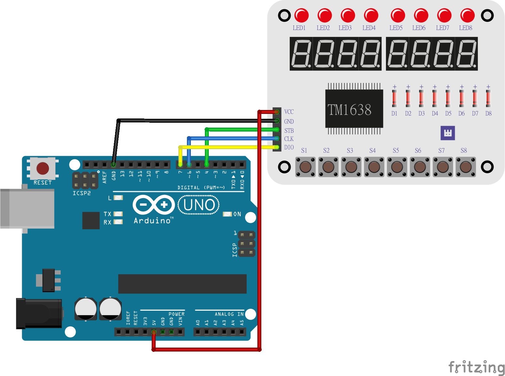

# Whadda WPM461 chip key display module

This example shows how you can drive the LEDs and 7-segment displays of the display module in various ways with an Arduino® compatible board.

## Library dependencies
Make sure you have the following Arduino libraries installed before trying to upload the example to your Arduino compatible board:

  * TM1638plus library  

## Wiring diagram

## Additional information
  For more information about the Whadda WPM461 chip key display module, check the manual available at [whadda.com](https://whadda.com)

## Acknowledgments
Based on TM1638plus_HELLOWORLD_TEST_Model1.ino example from TM1638plus library

Author: Gavin Lyons.

URL: https://github.com/gavinlyonsrepo/TM1638plus